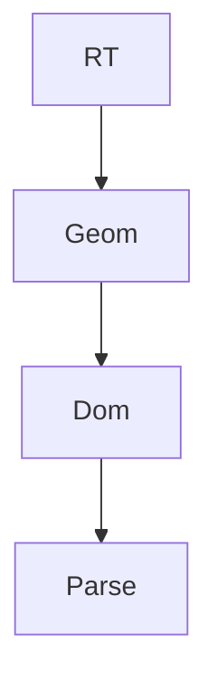

# ARCTK

[](https://crates.io/crates/arctk)
[](https://docs.rs/arctk)


Numerical simulations of physical systems.

## Quickstart

Clone the repository and set the current working directory to the top level `arctk` folder:

```sh
git clone git@github.com:FreddyWordingham/arctk.git
cd arctk
```

and then install the binary:

```sh
cargo install --path . --release
```

after which you can use the tools:

```sh
mcrt -i input/ -o output/ parameters.json
```

## Modules

Sub-module dependency diagram:


