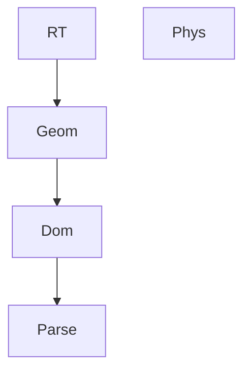

# ARCTK

<p align="center">
    
</p>

[](https://docs.rs/arctk)

[](https://crates.io/crates/arctk)


Numerical simulations of physical systems.

## Quickstart

Clone the repository and set the current working directory to the top level `arctk` folder:

```sh
git clone git@github.com:FreddyWordingham/arctk.git
cd arctk
```

and then install the library:

```sh
cargo install --path . --release
```

## ARCTK in the wild

`arctk` is a collection of classes that form the simulation framework for other projects:

-   [Antler](https://github.com/FreddyWordingham/antler) - A textureless rendering engine
-   [MCRT](https://github.com/FreddyWordingham/mcrt) - A physically accurate light dosimetry tool
-   [SOLAR](https://github.com/digiLab-Ai/solar) - A tool used to determine the expected power output of solar panels

## Modules

Sub-module dependency diagram:


